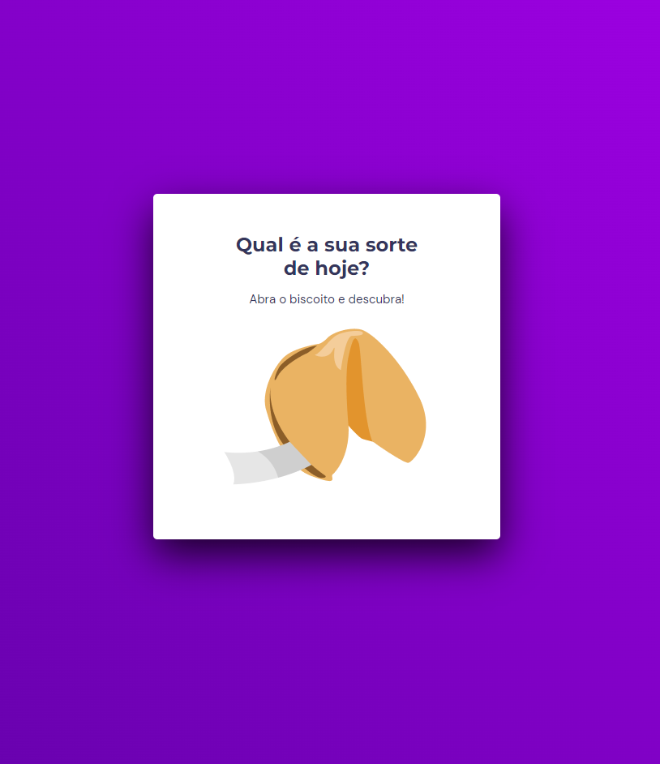

# Biscoito da Sorte

Este projeto é uma aplicação web interativa chamada "Biscoito da Sorte". Inspirada nos tradicionais biscoitos da sorte, a aplicação gera frases aleatórias de motivação e positividade quando o usuário "abre" um biscoito virtual.

  

## Funcionalidades

- Abertura interativa de um biscoito da sorte virtual.
- Exibição de frases motivacionais e positivas aleatórias.
- Interface de usuário intuitiva e agradável.
- Animações suaves para uma melhor experiência do usuário.

## Tecnologias Utilizadas

- HTML
- CSS
- JavaScript

## Projeto finalizado
- (https://devgentil.github.io/BiscoitoSorte/)

## Licença
Este projeto é licenciado sob a Rocketseat, o que significa que você pode usá-lo livremente para fins pessoais e comerciais, mas deve manter o reconhecimento do autor original.

Feito com ❤️ por [DevGentil](https://github.com/DevGentil).
